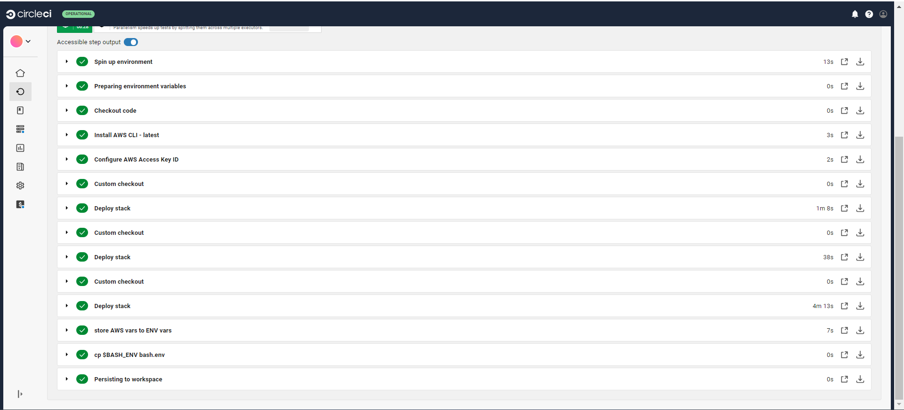
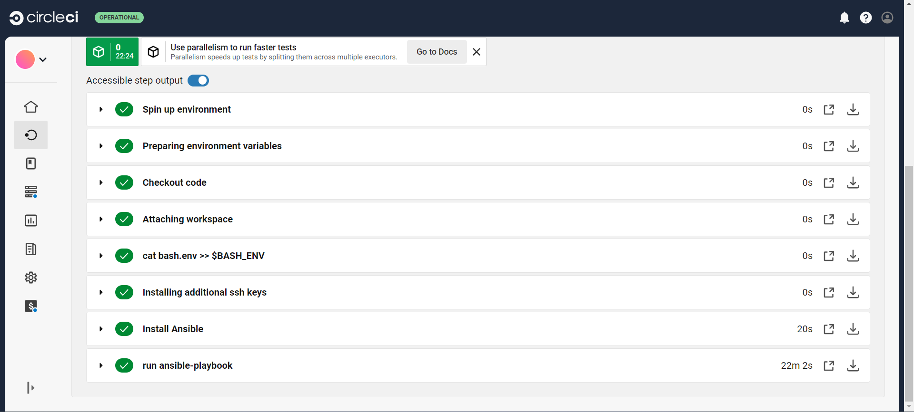
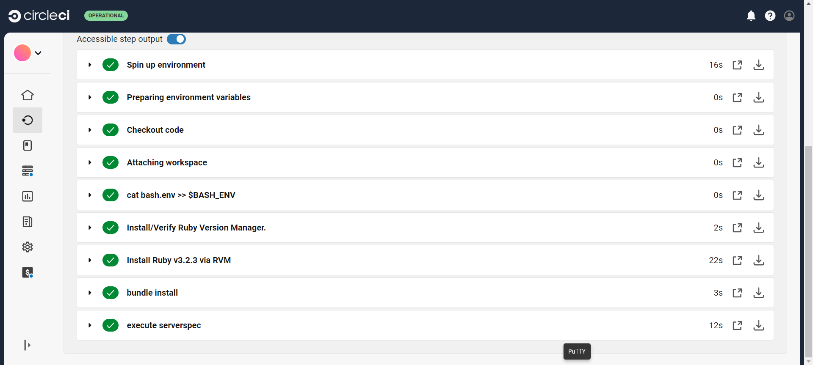
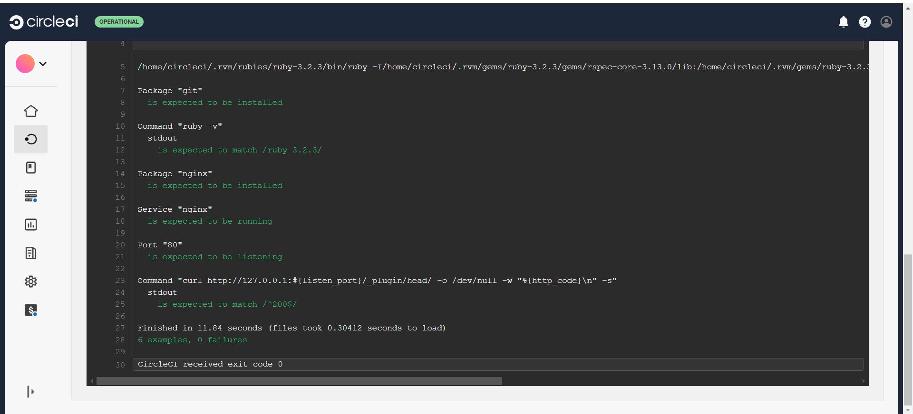
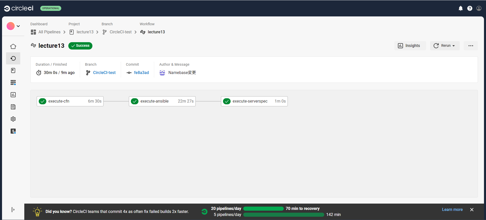
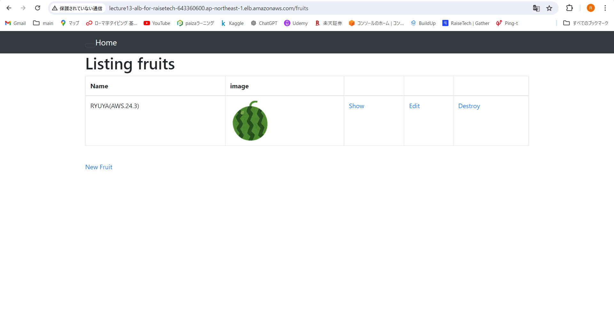

# 第13回課題
### CircleCIにCloudFormationやServerSpec、Ansibleの処理を追加し実行する。
## CircleCIのコンソールで環境変数を設定する。
- AWS_ACCESS_KEY_ID(アクセスキー)
- AWS_SECRET_ACCESS_KEY(シークレットアクセスキー)
- AWS_DEFAULT_REGION(リージョン)
- AWS_DB_PW(RDSのパスワード)
## CircleCIの実行
### CloudFormationのテンプレートを用いてスタックの作成
- CircleCIの[config.yml](.circleci/config.yml)にCloudFormationテンプレートを実行する処理を追加  
- [create-resources.yml](cloudformation/create-resources.yml)のparametersのKeyPairを自身のKeyPairに変更  
- 実施結果

### Ansible-Playbookの実行
- CircleCIの[config.yml](.circleci/config.yml)にAnsibleのPlaybookを実行する処理を追加  
- [ansible.cfg](ansible/ansible.cfg)を作成  
- CircleCIのコンソールでSSH Keysを追加し、[config.yml](.circleci/config.yml)のfingerprintsを変更  
- 実施結果

### Serverspecによるテスト実行
- CircleCIの[config.yml](.circleci/config.yml)にServerspecのテストを実行する処理を追加  
- 実施結果

### CircleCI結果

### ALBのDNS名でアクセスし、アプリが動作することを確認

